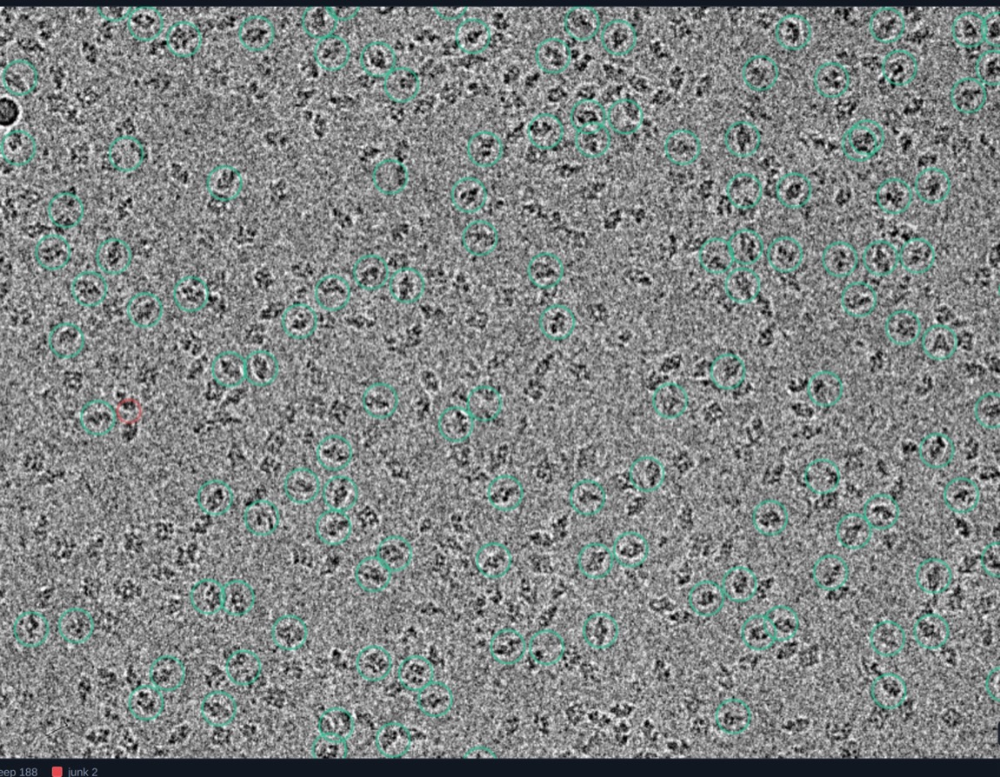
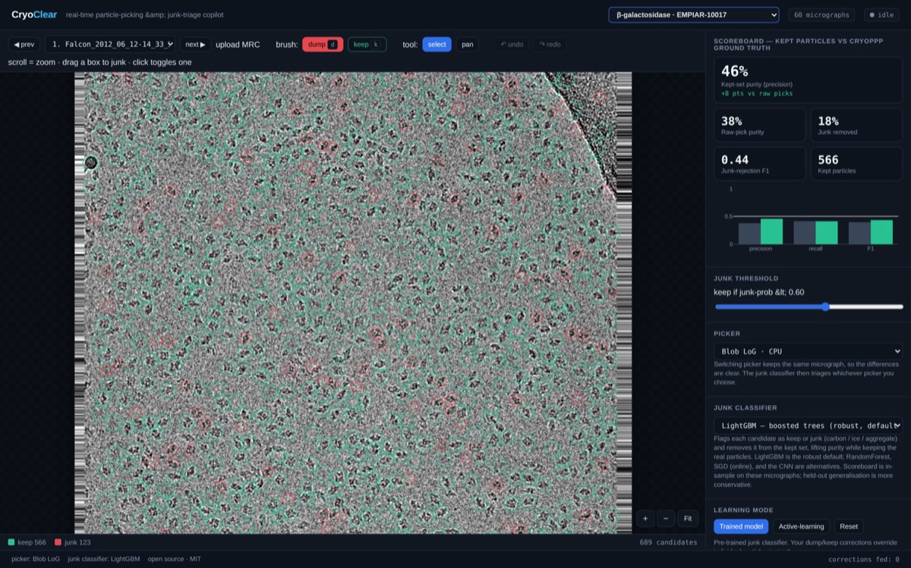
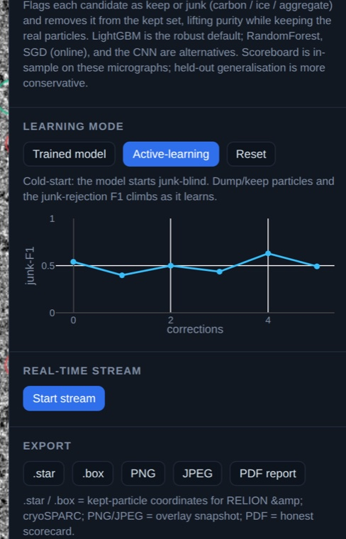
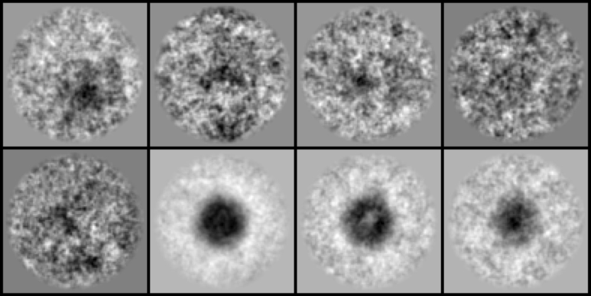
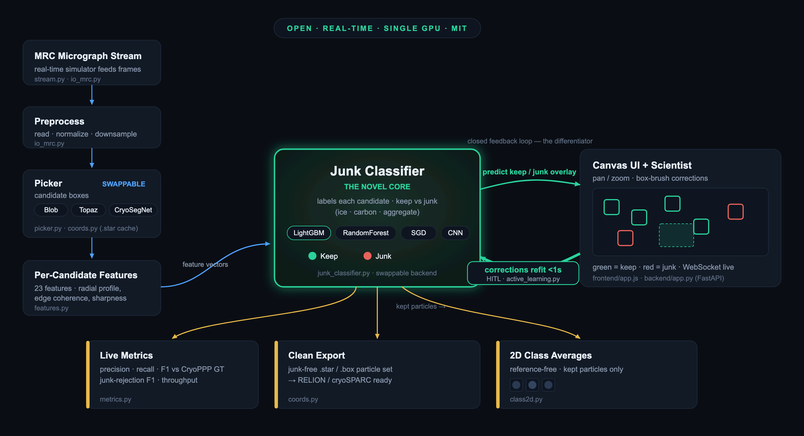
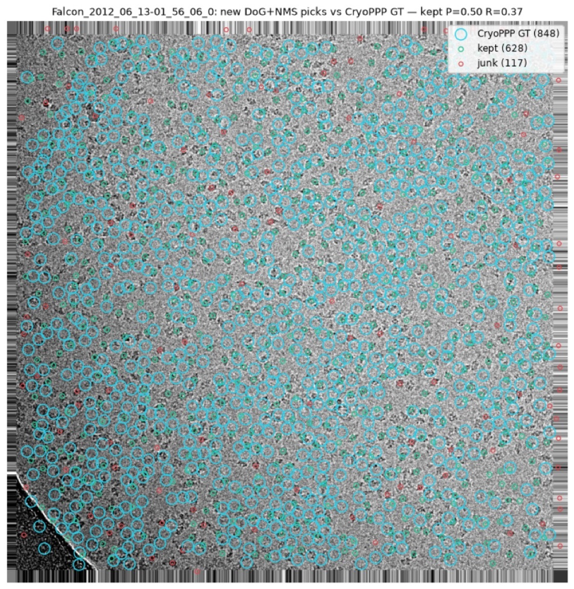

# CryoClear

**An open, real-time platform for cryo-EM particle picking + junk triage, with a human-in-the-loop learning loop.**

CryoClear sits on top of any picker, classifies each candidate as keep or junk (ice, carbon edges, aggregates) as micrographs stream in, lets the scientist correct it in bulk on an interactive canvas, learns from those corrections live, and reports honest precision/recall/F1 against expert ground truth — then exports clean coordinates for RELION/cryoSPARC.

<p align="center">
  <br>
  <sub><b>Live picking on EMPIAR-10017 β-galactosidase</b> — green = kept particle, red = flagged junk, classified in real time.</sub>
</p>

> **Honest positioning:** we do **not** claim a novel picking model. The contribution is the **product + the live junk‑intelligence layer** that no open tool ships.

### What's novel (and defensible)
1. **A dedicated, live human‑in‑the‑loop *junk* classifier** — not the picker. Every other tool folds junk removal into the picker or into post‑hoc 2D selection; CryoClear runs a separate keep/ice/carbon/aggregate model that **refits on CPU in under a second from the scientist's clicks while the GPU keeps picking**.
2. **Uncertainty‑guided active learning** — the app surfaces the candidates the model is *least sure about* (junk‑prob near the threshold, shown in amber); correcting **those** teaches it fastest. Most tools make you hunt; we rank the highest‑value corrections. This is the *active* in active learning.
3. **One swappable interface over picker × classifier × dataset** — blob / Topaz / CryoSegNet pickers, LightGBM / RF / SGD / CNN classifiers, 7+ proteins, all behind one live UI; switching keeps the same micrograph so differences are obvious.
4. **Honest, junk‑aware measurement** — CryoPPP ships labeled ice/carbon false positives, so we report junk‑rejection F1 and **kept‑set purity** (which the triage measurably lifts on every micrograph), not just an optimistic picking number.

The closest prior art (TranSPHIRE) retrains the *picker* *automatically*, in batches; CryoClear's loop is **human‑driven, per‑click, sub‑second, and targets junk triage** — and it's open and light enough to run on one GPU.

## Table of Contents

- [Overview](#overview)
- [What CryoClear Does](#what-cryoclear-does)
- [Quickstart (uv)](#quickstart-uv)
- [Features (M1–M4)](#features-the-milestone-ladder-all-live)
- [Architecture](#architecture)
- [Junk Classifier](#junk-classifier-the-novel-piece)
- [Evaluation & Metrics](#evaluation--metrics-honest)
- [Status](#status)
- [License](#license)

---

## Overview

Cryo-EM datasets can contain thousands of micrographs, and a significant fraction of picked "particles" are junk — ice contamination, carbon edge artifacts, aggregates, and damaged regions. Today, scientists catch this junk manually: they scroll through picks after the run, discard bad ones by eye, re-run the picker with adjusted settings, and repeat. This loop is slow, error-prone, and happens *after* hours of data collection, not during it.

Existing autopickers (Topaz, crYOLO, CryoSegNet) excel at finding particles but ship no junk-triage layer. The feedback from a scientist's corrections never flows back into the session automatically. And there is no standard, real-time dashboard showing how clean the particle stack actually is.

## What CryoClear Does

CryoClear wraps state-of-the-art pickers with an interactive, real-time junk-removal copilot:

- **Streams micrographs as they arrive** — no waiting for the full dataset
- **Classifies picks on the fly** — flags ice patches, carbon edges, and aggregates before they contaminate your stack
- **Learns from corrections** — every accept/reject from the scientist updates the junk classifier in-session
- **Reports honest metrics** — precision, recall, and F1 against expert ground truth, so you know exactly how clean your stack is

<p align="center">
  <br>
  <sub>The live app — canvas micrograph viewer, swappable picker + junk classifier, and a live precision / recall / F1 scoreboard.</sub>
</p>

---

## Quickstart (uv)

We use [uv](https://docs.astral.sh/uv/) for env + packaging.

```bash
# 0. install uv once:  curl -LsSf https://astral.sh/uv/install.sh | sh
uv sync                                   # env + deps + lock
uv run pytest -q                          # sanity check

# --- the real-time app (FastAPI backend + React canvas frontend) ---
uv run python backend/precompute.py --empiar 10017          # parallel cache (uses all cores)
uv run python scripts/train_classifiers.py --empiar 10017   # RF + LightGBM junk scores
uv run uvicorn backend.app:app --host 0.0.0.0 --port 8501   # open http://localhost:8501

# eval harness (synthetic; no data needed)
uv run python eval/run_eval.py --demo
```

The enterprise app (`backend/` + `frontend/`) is the primary UI: a canvas micrograph
viewer with pan/zoom, **box-brush** bulk keep/dump HITL with **undo/redo** (Ctrl/Cmd+Z),
a swappable **picker** (blob / Topaz / CryoSegNet), a swappable **junk classifier**
(RandomForest / LightGBM / CNN) with per-model calibrated thresholds, a **multi-dataset
switcher** (β-gal / TRPV1 / proteasome), a live Plotly scoreboard, WebSocket streaming, 2D
class averages, **upload-your-own-MRC**, and `.star`/`.box`/PNG/PDF report export.
(`app/streamlit_app.py` is a simpler Streamlit version kept as a fallback.)

## On the GPU box (RunPod)

```bash
uv sync                                  # our package + CPU deps
# install torch (CUDA build) from pytorch.org, then CryoSegNet (its own conda env)
uv pip install -e ".[gpu]"               # ASPIRE for the 2D-class wow (optional)
```

Full GPU + data + milestone plan: [`docs/07_runpod_build_plan.md`](docs/07_runpod_build_plan.md).

---

## Features (the milestone ladder, all live)

| | Feature | What it does |
|---|---|---|
| **M1** | Picking + junk flags + metrics | Pick particles (blob LoG or CryoSegNet), classify each candidate keep/junk, score precision/recall/F1 vs CryoPPP ground truth. |
| **M2** | Live active learning | Cold-start a tiny junk model, teach it corrections, watch junk-rejection F1 climb live (the "it learns from me" loop). |
| **M3** | Real-time streaming | Auto-feed micrographs on a timer with a live throughput + %junk dashboard. |
| **M4** | 2D class averages | Reference-free 2D classification of the kept particles → class-average montage (the "these picks are real" proof). |

<table>
<tr>
<td width="50%" valign="top"><br><sub><b>M2 — live active learning:</b> cold-start junk-blind, then watch junk-rejection F1 climb as you box-brush keep/dump corrections.</sub></td>
<td width="50%" valign="top"><br><sub><b>M4 — 2D class averages</b> of the kept particles: reference-free alignment + k-means on band-pass crops.</sub></td>
</tr>
</table>

Run each: `make app` then toggle the sidebar (Active-learning / Auto-stream) and the
"2D class averages" expander. CLI: `scripts/run_baseline.py`, `scripts/train_junk_classifier.py`,
`eval/class_averages.py`, `eval/heldout_eval.py`.

## Architecture

<p align="center">
  
</p>

Forward data flow in blue, the human-in-the-loop correction loop in green, measurable outputs in gold — with the real module names on each block.

<details><summary>Text version</summary>

```
MRC micrograph → preprocess (io_mrc) → picker (blob LoG | CryoSegNet/SAM, cached .star)
   → per-candidate features (features.py) → JUNK CLASSIFIER (RandomForest, junk_classifier.py)
   → active-learning update from corrections (active_learning.py)
   → UI overlay green=keep / red=junk + live metrics (metrics.py) + stream dashboard (stream.py)
   → 2D class averages of kept particles (class2d.py)  → montage
```

</details>

## Junk Classifier (swappable baseline)

Three interchangeable backends over **23 intensity-normalised per-candidate features**
— radial profile, matched-filter (Gaussian NCC), structure-tensor edge coherence,
distribution shape, and sharpness — selectable live in the UI:

- **RandomForest** (scikit-learn) — fast; over-rejects unless run at a high threshold.
- **LightGBM** (gradient-boosted trees) — best honest accuracy and threshold-robust; the default.
- **CNN** (`cnn_classifier.py`, torch on GPU) — learns features from raw 64×64 crops.

Most features are normalised by the per-crop mean/std so they generalise *across*
micrographs (raw intensity drifts between exposures — that drift is what made the old
raw mean/min/max features memorise individual micrographs). Richer features lifted
LightGBM's held-out junk-F1 from **0.47 → 0.64**. Labels come from CryoPPP (a candidate
matching a ground-truth particle = keep, else junk); refits in well under a second.

## Pickers (swappable, cached)

The picker is selectable live; the junk classifier then triages whatever it picks:

- **Blob LoG** — fast, deliberately over-picks (the default; junk-triage has the most to do).
- **Topaz** — pretrained CNN detector (`scripts/run_topaz.py`, GPU); picks cached as `.star`.
- **CryoSegNet** — SAM + attention-gated U-Net (GPU); picks cached as `.star`.

On β-gal these bracket the trade-off precisely: blob over-picks (~5k candidates/micrograph,
lots of junk to remove), CryoSegNet under-picks (~hundreds, high-precision). Non-blob picks
are generated offline on the GPU and cached, so the live app never blocks on inference.

## Evaluation & Metrics (honest — read this)

On EMPIAR-10017 β-galactosidase (real CryoPPP ground truth), **micrograph-level held-out**
picking F1. We improved the picker substantially:

| picker | held-out raw F1 | after triage |
|---|---|---|
| Old LoG blob (dense over-pick, ~5000/mic) | 0.227 | 0.248 |
| **DoG band-pass + NMS + local-norm + carbon exclusion** (~700/mic, distinct) | **0.373→0.380** | **0.380** |

<p align="center">
  <br>
  <sub>Candidate picks overlaid against CryoPPP expert ground-truth positions — how every precision / recall / F1 number here is scored.</sub>
</p>

That's **+67%** on the raw picking number, and the picks are now distinct and human-like
(carbon edges excluded) instead of a blanket. Published deep-learning pickers reach
~0.73–0.76 F1 *on their own eval protocols* (different splits, per-protein training) — we
cite them for **context, not a head-to-head**: the picker is a swappable, dependency-light
default, and CryoClear's contribution is the live junk-triage layer, not the picker.

Honest notes: per-model **threshold calibration** is essential (a vanilla RF at 0.5
over-rejects); with the stronger picker the classifier stays conservative (high threshold)
so the triage *delta* is small but the absolute number is higher; the in-sample ≈0.998 a
vanilla RF shows is overfitting (we report held-out).

CryoSegNet runs on the GPU (incl. NVIDIA Blackwell via a torch-cu128 env) but under-picks
β-gal with default settings (recall ≈ 0.11).

Reproduce: `uv run python eval/compare_classifiers.py --empiar 10017` and
`uv run python eval/heldout_eval.py --empiar 10017 --radius 54 --box 108`.

## Running on the GPU box

See [`docs/07_runpod_build_plan.md`](docs/07_runpod_build_plan.md) and
[`docs/08_runpod.md`](docs/08_runpod.md). CryoSegNet on a Blackwell GPU:
[`scripts/setup_cryosegnet_blackwell.sh`](scripts/setup_cryosegnet_blackwell.sh).

---

## Status

**M1–M4 are all built and running on real data** (EMPIAR-10017). The app is an interactive
FastAPI + React copilot (with a Streamlit fallback); `metrics.py`, `features.py`, `coords.py`, `class2d.py` are tested. Honest
about limits: in-sample picking numbers are optimistic; held-out generalization of the
*picking* improvement needs threshold calibration (the *junk-rejection* generalizes well).

## License

MIT (required by the hackathon — see `LICENSE`).